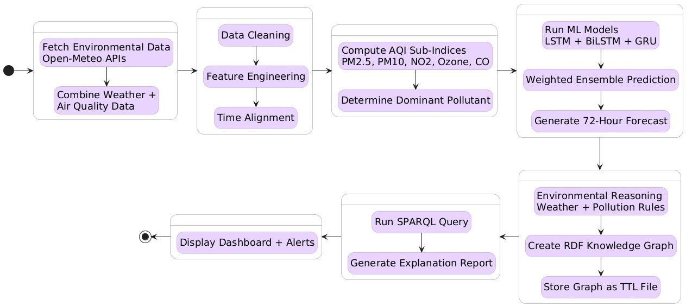

# AirSpy: Explainable AQI Forecasting System

🔗 **[Live Demo](https://aqi-prediction-system-with-rdf-expl.vercel.app/)**

AirSpy is an end-to-end air quality forecasting system that predicts AQI trends across Indian cities up to 72 hours ahead — and explains *why*, not just *what*. A deep learning ensemble generates the forecast, while an RDF knowledge graph layer traces each prediction back to the pollutants and environmental conditions driving it.

> This repo contains the **frontend** of the system. The model and backend (FastAPI + TensorFlow/Keras) are kept in a separate, closed-source repository. The live demo above runs the complete system end-to-end, including the live backend.

## How the system works

1. **User selects a city or location** on the dashboard
2. **A deep learning ensemble** (LSTM, BiLSTM, GRU) forecasts AQI for the next 72 hours, trained on 26,000+ records from the CPCB dataset containing data from 4 Indian cities for better generalization and over t he time period of an entire year 2024 to encounter seasonal changes as well as the affect of geographgical location on them.
3. **An RDF knowledge graph** is built around the prediction, linking the forecasted AQI to the specific pollutants and conditions contributing to it
4. **The dashboard renders** the forecast, a pollutant breakdown, and an explainability view — so the prediction isn't just a number, it comes with reasoning

Model performance: 85–90% AQI category accuracy and 80–88% trend direction accuracy across 72-hour forecasts. Like any real-world forecasting model, predictions can occasionally diverge from actual conditions — particularly for locations or conditions underrepresented in the training data.

## What this repo contains

This is the **frontend dashboard** — a React + TypeScript app that:
- Lets users pick a city/location and view a live AQI forecast
- Displays the predicted AQI alongside the 72-hour trend
- Shows a breakdown of the dominant pollutants behind the prediction
- Visualizes the RDF knowledge graph explaining the prediction
- Talks to the AQI prediction backend over a REST API

## Tech stack

- **React + TypeScript** (Vite)
- **Tailwind CSS** + shadcn/ui components
- REST API calls to a FastAPI backend running the forecasting model

## Architecture



## Running locally

**Requirements:** Node.js v16+

```bash
npm install
npm run dev
```

Open the local URL Vite prints in your terminal (usually `http://localhost:8080`).

### Environment setup

Create a `.env` file in the project root:

```
VITE_API_URL=http://localhost:8000
```

Point this at wherever the backend is running. A `.env.example` is included as a template.

> **Note:** This frontend needs a running instance of the AirSpy backend to actually return predictions. Without it, API calls will fail. The live demo above already includes a deployed backend, so no local setup is needed to see the full system in action.
